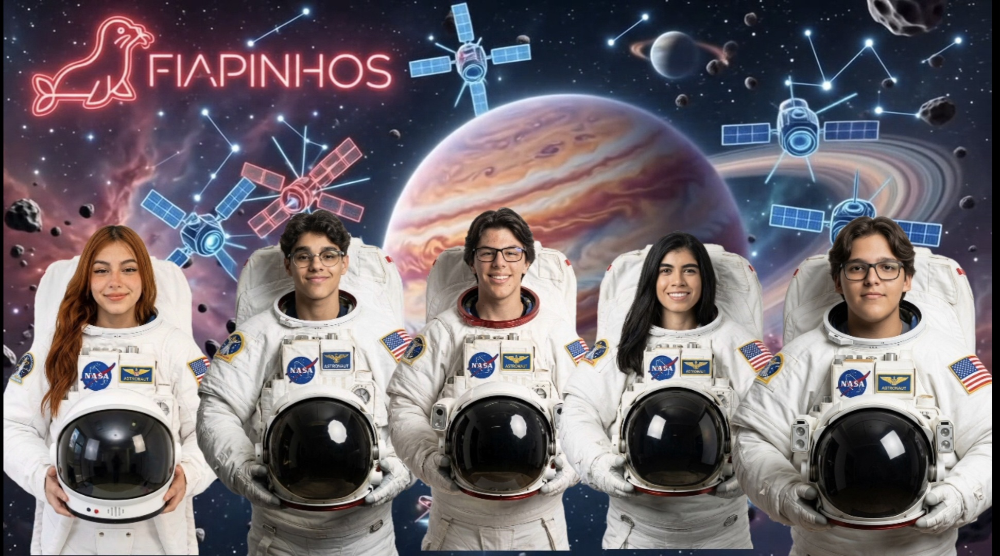

<p align="center">
<a href="https://www.fiap.com.br/"></a>
</p>

<h1 align="center">🛰️🌧️ ClimateArgos — Monitoramento Climático via Satélite</h1>

<p align="center">


</p>

<p align="center">
<i>Sistema de monitoramento e previsão de riscos climáticos com dados de satélite e inteligência artificial.</i>
</p>

<p align="center">
<a href="https://climate-argos.vercel.app/">🔗 Acessar o Site</a>
</p>

---

## 🎯 O Problema

O Brasil é um dos países mais vulneráveis a desastres climáticos. Enchentes, deslizamentos e rompimentos de barragens causam centenas de mortes e bilhões em prejuízos todos os anos:

- 🌊 **1.5M+** de pessoas vivem em áreas de risco
- 💸 **R$170Bi** em prejuízos com desastres (2013-2023)
- 🏘️ **4.000+** municípios vulneráveis
- ⚠️ Sistemas de alerta chegam tarde demais ou simplesmente não existem

---

## 🚀 A Solução

O **ClimateArgos** integra dados de satélites, sensores e modelos de IA para prever e alertar sobre riscos de desastres naturais com antecedência:

| Feature | Descrição |
|---------|-----------|
| 🗺️ Mapa Interativo | Zonas de risco com dados em tempo real via Leaflet |
| 🌦️ Dados Climáticos | Temperatura, umidade, vento e precipitação via OpenWeather |
| 🚨 Central de Alertas | Alertas meteorológicos do INMET com classificação de risco |
| 🛰️ Imagens de Satélite | Visualização de camadas NASA Earthdata (MODIS, VIIRS) |
| 🧠 IA Preditiva | Modelo de risco com fatores climáticos e geológicos |
| 📊 Telemetria | Status de satélites e métricas em tempo real |

---

## 🌍 Alinhamento com ODS

| ODS | Contribuição |
|-----|-------------|
| **9** — Indústria, Inovação e Infraestrutura | Tecnologia de ponta aplicada à proteção civil |
| **11** — Cidades e Comunidades Sustentáveis | Alertas preventivos para reduzir vulnerabilidade urbana |
| **13** — Ação Contra a Mudança do Clima | Monitoramento de eventos extremos e adaptação climática |

---

## 🎨 Design

- 🌑 **Dark Mode** com tons de ciano e roxo
- 🛰️ Interface inspirada em centros de controle de satélites
- 📱 Layout responsivo com sidebar colapsável

---

## 📁 Estrutura do Projeto

```
├── public/
│   └── assets/
├── src/
│   ├── app/
│   │   ├── components/
│   │   │   ├── AlertSystem.tsx
│   │   │   ├── AIPrediction.tsx
│   │   │   ├── SatelliteImagery.tsx
│   │   │   ├── SatelliteMap.tsx
│   │   │   ├── StatsBar.tsx
│   │   │   └── WeatherPanel.tsx
│   │   ├── pages/
│   │   │   ├── DashboardPage.tsx
│   │   │   └── SobrePage.tsx
│   │   ├── services/
│   │   │   ├── alerts.ts
│   │   │   ├── satellite.ts
│   │   │   └── weather.ts
│   │   └── App.tsx
│   ├── styles/
│   │   ├── index.css
│   │   └── theme.css
│   └── main.tsx
├── index.html
├── package.json
├── tsconfig.json
├── vite.config.ts
└── vercel.json
```

---

## 👨‍🎓 Integrantes — Equipe Fiapinhos

| Nome | LinkedIn |
|------|----------|
| Bruna Sousa | [](https://www.linkedin.com/in/brunasousasantos/) |
| Davi Simione | [](https://www.linkedin.com/in/davi-simione-01127830b/) |
| Caio Leme | [](https://www.linkedin.com/in/caiobertaglia/) |
| Gabriel Kott | [](https://www.linkedin.com/in/gabriel-kott-3494342ab/) |
| Gabriele Lopes | [](https://www.linkedin.com/in/gabrielelopes1925/) |

## 👩‍🏫 Tutor

| Nome | LinkedIn |
|------|----------|
| Lucas Gonzalez | [](https://www.linkedin.com/in/profgonzalez/) |

---

<p align="center">
<b>© 2026 ClimateArgos — FIAPINHOS</b>
</p>
